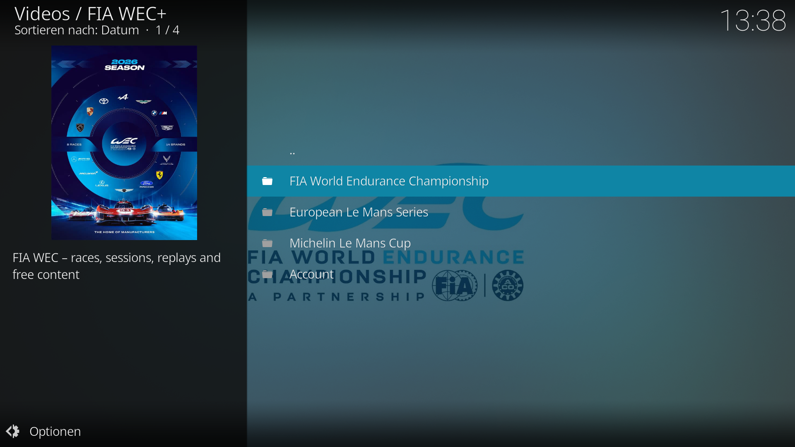
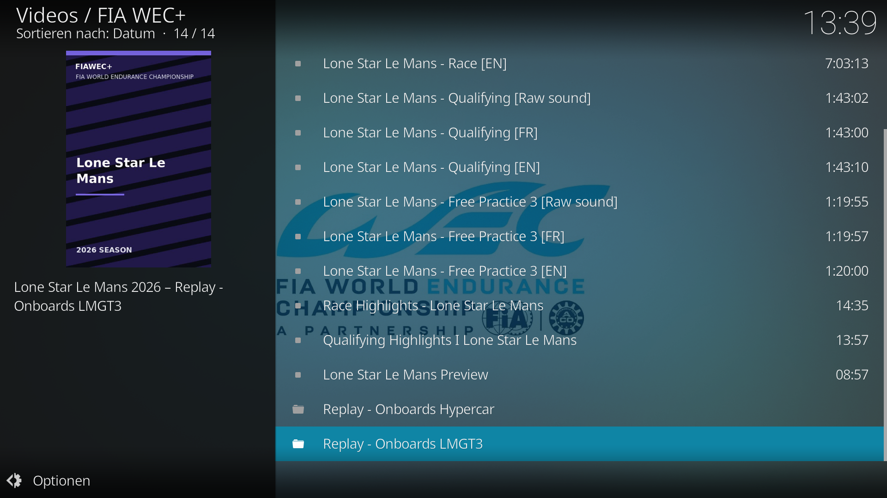
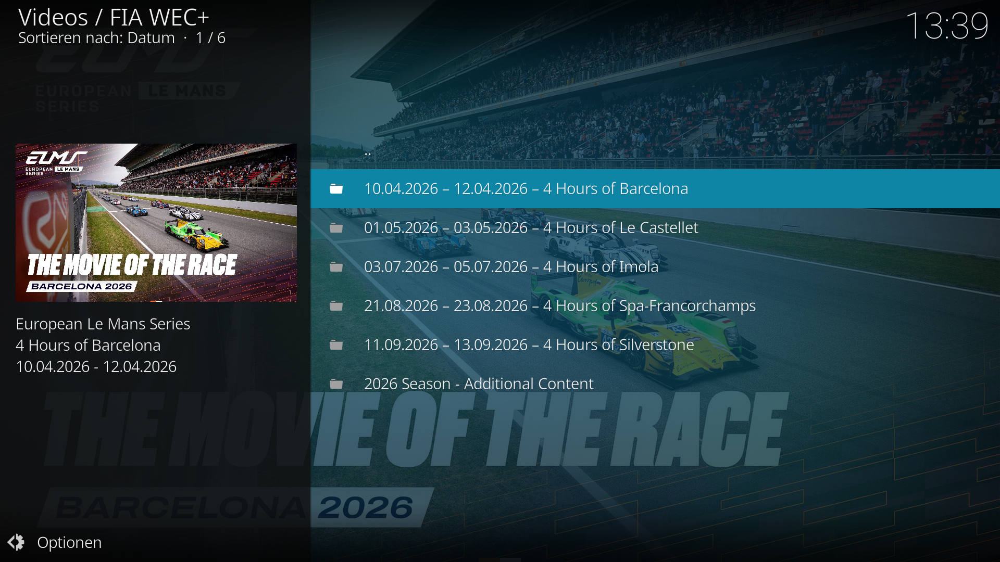
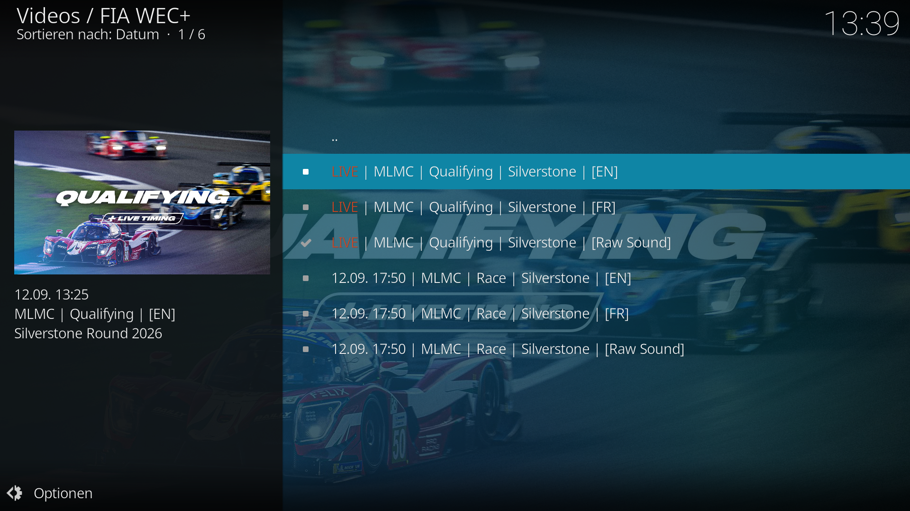
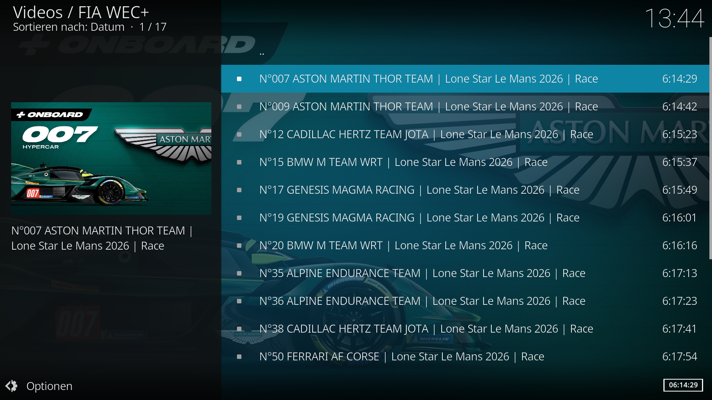

# FIA WEC+ for Kodi

Unofficial Kodi video add-on for **FIA World Endurance Championship (WEC)**, **European Le Mans Series (ELMS)** and **Michelin Le Mans Cup (MLMC)** content published through FIA WEC+ / Staylive.

Developed and maintained by **MiSeRy**.

[](https://github.com/MiSeRy81/plugin.video.fiawecplus/releases/latest)
[](https://kodi.tv/)
[](https://github.com/MiSeRy81)

---

## Features

- FIA WEC, ELMS and Michelin Le Mans Cup
- Navigation by season and event
- Races, qualifying, practice sessions, highlights and replays where available
- WEC and ELMS onboard replays
- Upcoming and live WEC, ELMS and MLMC sessions
- `LIVE`, `TODAY` and `TOMORROW` indicators for upcoming streams
- EN, FR and Raw Sound stream variants where available
- Stream-specific artwork and event backgrounds
- Official FIA WEC 2026 race artwork
- WEC race Hero/Cover backgrounds where available
- Chronological livestream sorting
- Subscription-protected and free content handling
- FIA WEC+ account authentication
- Email/password sign-in
- Cookie-based sign-in
- Automatic access-token renewal
- Internal caching for faster navigation

---

## Screenshots

### Main Menu



### FIA WEC Race



### European Le Mans Series



### Upcoming Livestreams



### Hypercar Onboards



---

## Installation

1. Open the [FIA WEC+ Releases](https://github.com/MiSeRy81/plugin.video.fiawecplus/releases/latest) page.
2. Download the latest:

   `plugin.video.fiawecplus-<version>.zip`

3. Open Kodi.
4. Go to:

   **Add-ons → Install from ZIP file**

5. Select the downloaded ZIP package.
6. Open:

   **Add-ons → Video add-ons → FIA WEC+**

7. Configure your FIA WEC+ account from the **Account** menu if required.

---

## Authentication

The add-on supports FIA WEC+ / Staylive authentication for protected content.

Available login methods include:

- Email and password
- Existing FIA WEC+ / Staylive session cookie
- Cookie file

Access and refresh tokens are handled automatically where possible.

An FIA WEC+ account may also be required for content offered without a paid subscription.

Some FIA WEC content requires an active paid FIA WEC+ subscription.

ELMS and Michelin Le Mans Cup content may be available without an additional paid subscription depending on what FIA WEC+ / Staylive publishes.

---

## Livestreams

Upcoming livestreams are automatically collected from FIA WEC+ / Staylive.

The add-on can display:

- `LIVE` for currently running sessions
- `TODAY` for sessions taking place today
- `TOMORROW` for sessions taking place tomorrow
- Date and time for later sessions

Where available, separate feeds are shown for:

- English
- French
- Raw Sound
- ELMS onboard cameras

ELMS and Michelin Le Mans Cup livestream listings are filtered to actual playable video sessions such as **Qualifying** and **Race**.

---

## Onboards

FIA WEC and ELMS onboard content is supported where provided by FIA WEC+ / Staylive.

ELMS onboard entries include information such as:

- Class
- Car number
- Team
- Session

Example:

`LMP2 PRO/AM | #21 United Autosports | Race`

MLMC onboard folders are currently not included.

---

## Source Layout

The source code is split into focused modules instead of keeping the complete add-on in one large Python file.

```text
main.py                         Kodi entry point / compatibility handlers
resources/lib/api.py            HTTP and Staylive API helpers
resources/lib/auth.py           Cookie, account and token handling
resources/lib/cache.py          Internal response cache
resources/lib/config.py         Shared configuration/constants
resources/lib/diagnostics.py    Diagnostics helpers
resources/lib/onboard.py        WEC/ELMS onboard detection and filtering
resources/lib/playback.py       Kodi playback handling
resources/lib/routes.py         Action routing
resources/lib/series_data.py    Shared WEC/ELMS/MLMC event data logic
resources/lib/series_menu.py    ELMS/MLMC season and event menus
resources/lib/ui.py             Shared Kodi UI/list item helpers
resources/lib/utils.py          General utility helpers
resources/lib/video_menu.py     Video/feed/playlist presentation
resources/lib/wec_events.py     WEC season, race and event logic
```

The complete readable source is available directly in this repository.

Installable Kodi packages are available separately under **GitHub Releases**.

---

## Development

Contributions and improvements are welcome.

When submitting changes:

1. Fork the repository.
2. Create a branch for your changes.
3. Keep changes focused.
4. Test navigation and playback in Kodi.
5. Check WEC, ELMS and MLMC when modifying event matching.
6. Pay particular attention to similarly named events such as:
   - 24 Hours of Le Mans
   - Lone Star Le Mans
7. Include the Kodi version and platform used for testing when opening a pull request.

---

## Support the Project

FIA WEC+ for Kodi is developed and maintained in my free time.

If you enjoy the add-on and would like to support its continued development:

[](https://buymeacoffee.com/MiSeRy81)

Thank you for supporting the project! ☕

---

## Releases

The latest stable Kodi package can always be found here:

**[Download the latest FIA WEC+ release](https://github.com/MiSeRy81/plugin.video.fiawecplus/releases/latest)**

---

## Disclaimer

This is an **unofficial Kodi add-on**.

It is not affiliated with, endorsed by, sponsored by or associated with:

- FIA
- FIA World Endurance Championship
- Automobile Club de l'Ouest (ACO)
- European Le Mans Series
- Michelin Le Mans Cup
- Staylive

The add-on does not host, redistribute or provide video content itself.

All video content is requested from the official services and remains subject to their availability, access restrictions and subscription requirements.

Users are responsible for having the appropriate FIA WEC+ account, access rights and subscription for protected content.
